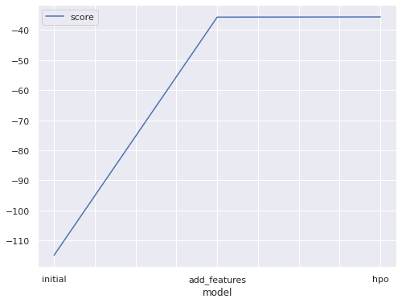
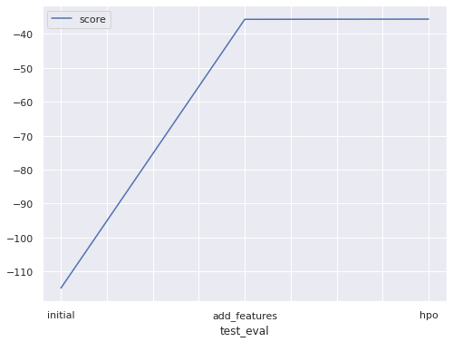

# Report: Predict Bike Sharing Demand with AutoGluon Solution
#### RUTH NDUTA

## Initial Training
### What did you realize when you tried to submit your predictions? What changes were needed to the output of the predictor to submit your results?
- Initially, the submission failed giving an error for the date time data type to be converted to string from datetime.
- Having negative values in the predictions may have also prohibited the submission from getting through since after replacing the negatives with zero it was successful.

### What was the top ranked model that performed?
- The WeightedEnsemble_L3 performed best with a score value of 7.214185.

## Exploratory data analysis and feature creation
### What did the exploratory analysis find and how did you add additional features?
- Data imbalance in the columns e.g the weather column where category 4 had only one entry.

| Weather | Count |
|---------|-------|
| 1       | 7192  |
| 2       | 2834  |
| 3       | 859   |
| 4       | 1     |

- Holiday column also had uneven data distribution which is understandable since we have fewer holidays compared to working days

| Holiday | Count |
|---------|-------|
| 0       | 10575 |
| 1       | 311   |

### How much better did your model preform after adding additional features and why do you think that is?
- The model performance greatly improved from a score of -116.245448 prior to feature engineering to -35.610270 after.
- This maybe due to the models used since they are able to select important features and ignore the less important thus e.g for the date column, separating it into year, months and days the models are able to gauge which to choose and which to ignore.

## Hyper parameter tuning
### How much better did your model preform after trying different hyper parameters?
- For Hyper parameter tuning, I only changed the parameters to default and auto for the model to use the parameters it sees fit. The model performance was not any different from the previous model from feature selection giving a score of -35.702828.

### If you were given more time with this dataset, where do you think you would spend more time?
- Seeing how the model performance did not improve with my choice of hyperparameters, I would spend more time working on this and i creating more features to fit into the training data.

### Create a table with the models you ran, the hyperparameters modified, and the kaggle score.
| model        | hpo1                    | hpo2         | hpo3       | score   |
|--------------|-------------------------|--------------|------------|---------|
| initial      | root_mean_squared_error | best_quality | regression | 1.39219 |
| add features | root_mean_squared_error | best_quality | regression | 0.45737 |
| hpo          | default                 | auto         | regression | 0.45873 |

### Create a line plot showing the top model score for the three (or more) training runs during the project.

### Create a line plot showing the top kaggle score for the three (or more) prediction submissions during the project.

## Summary

AutoGluon, an open-source AutoML tool uses just one line of Python code to train extremely accurate machine learning models on unprocessed tabular datasets like CSV files. It succeeds by assembling several models and stacking them in various layers. Experiments show that our multi-layer combination of several models makes better use of training time than searching for the best.

I enjoyed working with AutoGluon mainly because:

1.  Simplicity. you can immediately train a model on raw data without knowing anything about the data or ML models.
2.  Robustness. The framework can handle a wide range of structured datasets and ensures that training continues even if any of the individual machine learning models fail.
3.  Fault Tolerance. At any point when working, you can pause and resume it. 
4.  Timing that can be predicted. You can specify a timeframe for the results to be returned.
5.  Ability to tune your custom models and data pipelines with ease, or tailor the AutoGluon to your needs

AutoGluon allows simple-to-use and extensible AutoML, with a focus on automated stack ensembling, deep learning, and real-world applications encompassing text, image, and tabular data. 
